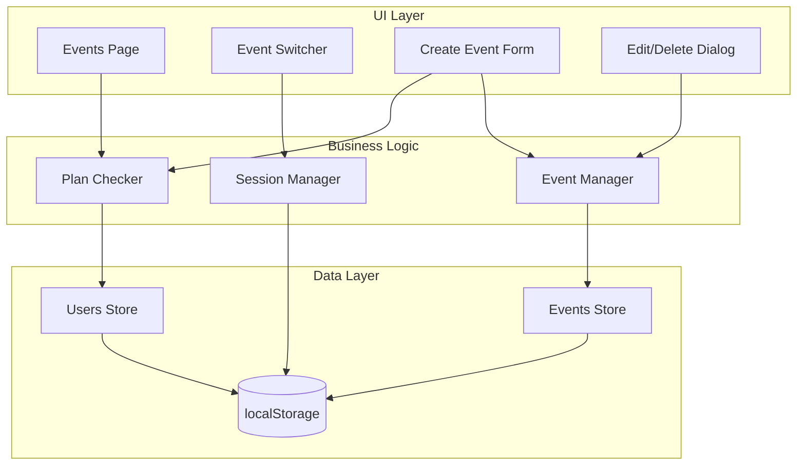

# Design Document: Plan-Based Event Creation

## Overview

This feature enables multi-event management for Certistage users based on their subscription plan. Users can create, view, switch between, and manage multiple events. The system enforces plan-based limits on event creation and provides a seamless event switching experience through a sidebar dropdown.

## Architecture

The feature follows the existing Next.js App Router architecture with client-side state management using localStorage. The implementation extends the current event system to support multiple events per user with plan-based restrictions.



## Components and Interfaces

### New Pages

1. **Events Page** (`/client/events/page.tsx`)
   - Lists all user's events with stats
   - Shows event usage (current/limit)
   - Create event button with plan check
   - Edit/Delete actions per event

2. **Create Event Page** (`/client/events/new/page.tsx`)
   - Event name and description form
   - Plan limit validation
   - Redirect to events list on success

### New Components

1. **EventSwitcher** (`components/client/event-switcher.tsx`)
   - Dropdown in sidebar showing current event
   - List of user's events
   - Quick switch functionality
   - "Manage Events" link

2. **EventCard** (`components/client/event-card.tsx`)
   - Displays event info (name, description, stats)
   - Edit and delete action buttons
   - Click to select as active event

3. **CreateEventDialog** (`components/client/create-event-dialog.tsx`)
   - Modal form for event creation
   - Name and description inputs
   - Plan limit warning if near limit

4. **EventUsageBar** (`components/client/event-usage-bar.tsx`)
   - Shows current event count vs limit
   - Progress bar visualization
   - Warning state at 80%+ usage
   - Upgrade CTA when at limit

### Updated Components

1. **ClientSidebar** - Add EventSwitcher component
2. **Dashboard** - Handle event switching updates

### New Functions in `lib/events.ts`

```typescript
// Check if user can create more events
function canUserCreateEvent(userId: string): { 
  canCreate: boolean
  currentCount: number
  maxEvents: number
  reason?: string 
}

// Create event with owner validation
function createEventForUser(
  userId: string, 
  name: string, 
  description?: string
): CertificateEvent | { error: string }
```

### New Functions in `lib/auth.ts`

```typescript
// Update session's active event
function updateSessionEvent(eventId: string, eventName: string): void

// Get user's event limit from plan
function getUserEventLimit(userId: string): number // -1 = unlimited
```

## Data Models

### Extended Session Interface

```typescript
interface ClientSession {
  eventId?: string        // Currently active event
  eventName?: string      // Active event name
  userId?: string
  userName?: string
  userEmail?: string
  userPlan?: PlanType
  loginType: "user" | "event"
  loggedInAt: string
}
```

### Event Ownership (Already Exists)

```typescript
interface CertificateEvent {
  id: string
  name: string
  description?: string
  ownerId?: string        // User ID who owns this event
  createdAt: string
  certificateTypes: CertificateType[]
  stats: {...}
}
```


## Correctness Properties

*A property is a characteristic or behavior that should hold true across all valid executions of a system-essentially, a formal statement about what the system should do. Properties serve as the bridge between human-readable specifications and machine-verifiable correctness guarantees.*

### Property 1: Event Ownership Filtering
*For any* user ID, the `getUserEvents()` function SHALL return only events where `ownerId` matches that user ID, and no events belonging to other users.
**Validates: Requirements 1.1, 3.2**

### Property 2: Plan Limit Enforcement
*For any* user with a plan that has `maxEvents >= 0`, the `canUserCreateEvent()` function SHALL return `canCreate: false` when `getUserEventCount(userId) >= maxEvents`, and `canCreate: true` otherwise.
**Validates: Requirements 2.1**

### Property 3: Event Creation with Owner Association
*For any* valid event name and user ID where `canUserCreateEvent()` returns true, the `createEventForUser()` function SHALL create an event with `ownerId` set to that user ID.
**Validates: Requirements 2.3**

### Property 4: Session Event Update Consistency
*For any* event ID and event name, after calling `updateSessionEvent()`, the session retrieved via `getClientSession()` SHALL have matching `eventId` and `eventName` values.
**Validates: Requirements 3.3, 3.4**

### Property 5: Event Count Display Accuracy
*For any* user, the displayed event count SHALL equal the result of `getUserEventCount(userId)` and the limit SHALL equal `PLAN_FEATURES[userPlan].maxEvents`.
**Validates: Requirements 4.1**

### Property 6: Warning Threshold Calculation
*For any* user where `(currentCount / maxEvents) >= 0.8` and `maxEvents > 0`, the system SHALL display a warning indicator.
**Validates: Requirements 4.2, 4.3**

### Property 7: Event Update Persistence
*For any* event ID and valid update data (name, description), after calling `updateEvent()`, the event retrieved via `getEvent()` SHALL reflect the updated values.
**Validates: Requirements 5.2**

### Property 8: Event Deletion Completeness
*For any* event ID, after calling `deleteEvent()`, the `getEvent()` function SHALL return null for that event ID, and no certificate types or recipients from that event SHALL exist.
**Validates: Requirements 5.4**

## Error Handling

| Scenario | Error Message | Action |
|----------|---------------|--------|
| Event limit reached | "You've reached your plan's event limit ({current}/{max})" | Show upgrade CTA |
| Free plan create attempt | "Free plan doesn't include event creation" | Show upgrade options |
| Event not found | "Event not found" | Redirect to events list |
| Invalid event name | "Event name is required" | Show form validation error |
| Delete active event | N/A | Auto-switch to another event or show events list |
| No events exist | N/A | Show empty state with create guidance |

## Testing Strategy

### Unit Tests
- Test `canUserCreateEvent()` with various plan types and event counts
- Test `getUserEvents()` returns correct filtered events
- Test `updateSessionEvent()` correctly updates session
- Test `deleteEvent()` removes event and associated data

### Property-Based Tests
Using a property-based testing library (e.g., fast-check for TypeScript):

1. **Event Ownership Property**: Generate random users and events, verify filtering
2. **Plan Limit Property**: Generate random plans and event counts, verify limit enforcement
3. **Session Update Property**: Generate random event data, verify session consistency
4. **Event CRUD Properties**: Generate random event operations, verify data integrity

Each property-based test will:
- Run minimum 100 iterations
- Be tagged with format: `**Feature: plan-based-event-creation, Property {number}: {property_text}**`
- Reference the specific correctness property being validated

### Integration Tests
- Test full event creation flow with plan checks
- Test event switching updates dashboard correctly
- Test event deletion handles active event case
